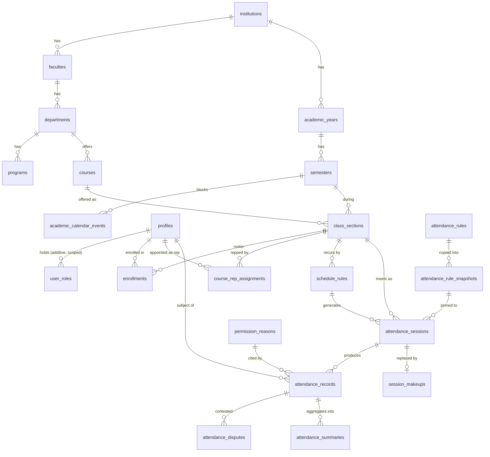

# Data model

`supabase/migrations/` is the single source of truth (ADR-001). This document explains it; the SQL defines it. Where they disagree, the SQL is right.

## The shape



Omitted for legibility: `invitations`, `audit_log`, `notifications`, `notification_preferences`, `email_events`, `job_runs`, `feature_flags`.

## The ten decisions that matter

Everything else is CRUD.

### 1. `attendance_records` is a ledger with `UNIQUE (student_id, session_id)`

One row per student per session. This constraint is the backstop for every duplicate-submission path in the product: the offline queue retrying on reconnect (§11.6), a double-firing `close_session()`, a student double-tapping on a bad connection. It is not an optimisation; it is the thing that makes the count mean something.

### 2. Absences are rows, not the absence of rows

`close_session()` writes an `absent` record for every enrolled student with no record. §6.1 calls this "the step most implementations forget; without it, absences don't exist as rows and percentages are wrong."

It is idempotent by construction — conditional session update, `on conflict do nothing` on the insert, and a pending sweep that only touches pending rows. Assume every job double-fires.

"Enrolled" is a **temporal** question, not a status one:

```sql
where e.enrolled_at <= session.starts_at
  and (e.dropped_at is null or e.dropped_at > session.starts_at)
```

A student who dropped in week 5 was still enrolled for week 3 and must be absent for it. A student who joined in week 6 must not be. Reading `enrollments.status` alone rewrites history every time someone drops.

### 3. `enrollments` is a real table

§5's own diagnosis: "the original spec conflated 'class' and 'cohort' and had no enrollment table at all. Attendance percentage is meaningless without it." This is the denominator.

### 4. Roles are rows, not an enum on the profile

`user_roles (user_id, role, scope_type, scope_id)` — additive and scoped. A user is Student **and** Course Rep simultaneously. A single enum would force a choice that reality does not offer.

`user_roles` is a UI convenience. The authority for a rep is `course_rep_assignments`, which is what RLS actually consults.

### 5. Rep grants are rows with a period

`course_rep_assignments (user_id, class_section_id, starts_at, ends_at, revoked_at)`.

The table exists to answer one question a boolean cannot: **"who was rep when this record was approved?"** — asked in week 14, about week 2, by someone disputing a grade. It supports co-reps, mid-term handover, revocation, and history.

`revoked_at` is deliberately distinct from `ends_at`: one is "the term ended", the other is "we took this away". Both end authority; only one is a judgement about the person.

An exclusion constraint forbids two *overlapping active* grants for the same user and section, while permitting the appoint → revoke → re-appoint history. A unique index cannot express that; a trigger would race.

### 6. Rules are versioned; sessions pin a **copy**

`attendance_rule_snapshots` is a copy, not a reference, and this is the whole point. If a session pointed at an `attendance_rules` row, editing that row in week 10 would retroactively change what week 2's records mean, and a student disputing a `late` would be arguing against a rule that did not exist on the day.

Snapshots are immutable, enforced by a trigger that rejects UPDATE and DELETE **for everyone including the table owner and service_role** — not by a policy, which the owner bypasses.

`sessions_open_has_rules_snapshot` makes it structural: there is no path to an open session whose rules can still move.

### 7. Four words that are not synonyms

The enum's whole value is in distinctions that a lazier model would collapse:

- **rejected** — claimed present, wasn't. Both it and absent count against attendance; collapsing them erases the difference between not turning up and being judged to have lied, which is exactly what a dispute turns on.
- **excused** — leaves the percentage denominator entirely. Driven by `permission_reasons.counts_as_excused`.
- **permission_granted** — stays in it. "We know why you missed it, and it still counts" is a real category someone chose on purpose.
- **unverified** (ADR-010) — the student submitted on time and nobody ever decided. **Not absent.** Marking them absent would have the database assert a fact it never established, and charge the student for a rep's inaction — the one thing they cannot influence.

The rule underneath: **silence from the student is absence; silence from the rep is not.** `close_session()` writes `absent` only for students who left no record at all, and `unverified` for those who did their part and were ignored.

`unverified` leaves the denominator (counted as neither attended nor missed), is counted separately on `attendance_summaries.unverified_count`, and stays decidable — a closed session is not a finalized semester, so a late verdict still resolves it to present/late via `submitted_at`. It is a state, not a grave.

The exploit worth naming: a rep who never verifies leaves their whole section resting on a small denominator. That is left to detection, not prevention — `unverified_count` on every summary and the rep-activity report (§10) make it loud. A control that punished students to prevent rep misconduct would be solving the wrong problem with the wrong person's grade.

### 8. Server time is authoritative, and a default is not enough

`submitted_at` is the single input `deriveStatus` anchors on, so a client that can set it can choose its own status. A column default only applies when the client *omits* the column — a client that supplies it overrides silently.

So `attendance_records_force_server_time` (0010) **overwrites** it for anyone holding a user JWT. A lying client is corrected, not rejected. `service_role` is exempt: seeds and backfills legitimately write history, and they are not reachable from a browser.

### 9. Percentages are maintained on write

`attendance_summaries`, one row per (student, section), maintained by trigger. §5: "do not compute `COUNT(*)` across a term on every dashboard load."

A summary **table**, not a materialized view: a matview refreshes wholesale, so one rep's approval would rebuild the aggregate for 10k students.

The counts are **fully recomputed** for the affected pair, not incremented. Delta arithmetic is where summary tables go wrong — every missed edge (a soft-delete, an override, a close sweep, a double correction) drifts the number silently, and nothing ever recomputes it to notice. A section is ~40 sessions; recomputing 40 rows beats being wrong about someone's exam eligibility.

`attendance_percent` is `null`, not `0`, when nothing countable has happened. A student in week 1 has no percentage; showing them 0% would fire a low-attendance warning on their first day.

### 10. The audit log is append-only, by trigger

Not by grants — a grant can be re-granted by a future migration written in a hurry, and RLS does not apply to `service_role` at all. A trigger applies to everyone, including the superuser. It is the only version of "append-only" that is actually true.

`log_audit()` is the sole door and stamps `actor_id` from `auth.uid()` itself, so an entry cannot lie about who acted.

## Security: two layers, not one

Postgres asks two questions, and RLS is only the second:

1. **GRANT** (`0014`) — may this role touch this table at all?
2. **RLS** (`0011`) — which of its rows may it see?

This bit us: the first pgTAP run failed with `permission denied for table attendance_records` rather than returning zero rows. Supabase's default privileges had not landed on these tables, so every logged-in user was locked out and the policies were never consulted.

The composition is deliberate:

- **anon** — everything revoked. Refused at layer 1, never reaches a policy. Two independent reasons a logged-out visitor sees nothing.
- **authenticated** — may ask; RLS decides. **DELETE is granted nowhere**: academic records are soft-deleted, the audit log is append-only, lookups are retired. A future DELETE policy written by mistake still could not delete anything.
- **service_role** — bypasses RLS, which is why `lib/supabase/admin.ts` is `import 'server-only'` and ESLint-fenced. Its power still stops at the triggers.

### The conflict-of-interest rule

§4 requires that a rep's own record be decided by a co-rep or the instructor. It is implemented as the more general truth: **nobody decides their own record.** `student_id <> auth.uid()` in both `using` and `with check`, for every role including admin.

The rule reads the same for everyone, has no exceptions to remember, and cannot be defeated by holding a second role.

## Conventions

- All timestamps `timestamptz`, stored UTC. The one exception is `schedule_rules.starts_at_local` — "Mondays at 10:00" must stay 10:00 across a DST change, so it is wall-clock by design.
- Every FK is indexed. Postgres does not do this for you.
- Partial indexes on the hot paths: the rep queue (`where status in (pending…)`) stays the size of the queue rather than the size of history.
- `updated_at` triggers on every mutable table.
- Soft-delete only where audit demands it; lookups are retired via `is_active`.
